Работу docker compose будем проводить на примере связки веб-приложения на Flask,  базы данных MySQL и nginx.


## Плохой docker compose:
```
services:
  db:
    image: mysql:latest  # версия latest
    container_name: db-mysql
    environment:
      MYSQL_ROOT_PASSWORD: root_password  # пароли в явном виде
      MYSQL_DATABASE: app_db
      MYSQL_USER: app_user
      MYSQL_PASSWORD: app_password
    volumes:  # данные теряются при перезапуске контейнера
      - ./init.sql:/docker-entrypoint-initdb.d/init.sql
    ports:
      - "3306:3306"  # доступ к базе данных извне
    restart: always  # будет перезапускаться даже при остановке с ошибкой (риск зацикливания)


  app:
    build: .
    container_name: predict-app
    environment:
      DB_HOST: db
      DB_NAME: app_db
      DB_USER: app_user
      DB_PASSWORD: app_password
    ports:
      - "5000:5000"  # доступ не только через nginx
    depends_on:
      - db  # нет healthcheck
    restart: always  # будет перезапускаться даже при остановке с ошибкой


  nginx:
    image: nginx:latest  # версия latest
    ports:
      - "80:80"
    volumes:
      - ./nginx.conf:/etc/nginx/nginx.conf
    depends_on:
      - app
    restart: always  # будет перезапускаться даже при остановке с ошибкой
```

### Плохие практики:
1. Использование :latest тегов - нет контроля версий, что нарушает принцип воспроизводимости окружения и приводит к постоянной загрузке новых образов.
2. Пароли в открытом виде - безопасность под угрозой, невозможность использования разных паролей для разных окружений.
3. Открытые порты БД - уязвимость безопасности, можно подключиться с любого устройства сети и из Интернета, если проброшены порты на роутере.
4. Открытый порт приложения - нарушение архитектуры, доступ должен быть только через nginx.
5. Нет healthcheck - без проверки доступности сервиса могут возникать ошибки, например, попытка подключения к базе данных, когда та ещё не готова принимать подключения.
6. Нет постоянного хранилища - записи в БД будут потеряны после перезапуска контейнера.
7. Перезапуск контейнера всегда - может привести к зацикливанию, если есть ошибка, приводящая к завершению работы контейнера

### Запуск:
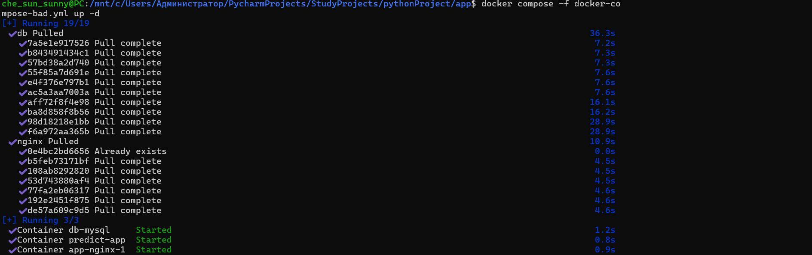
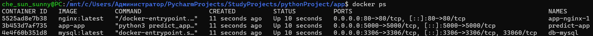

----
Видим, что БД доступна с localhost, приложение - через порт 5000 и через nginx
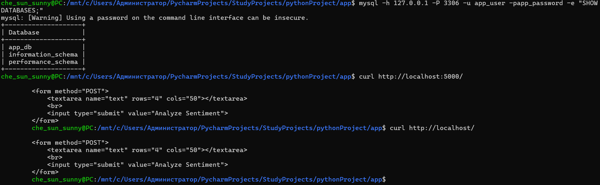
----
В браузере всё тоже работает


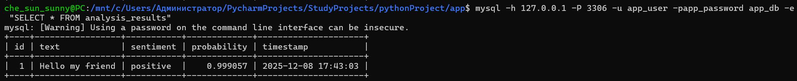

----
Ещё в процессе возникла интересная **ошибка**: до запуска этого файла был запущен другой docker compose, в котором создавалось постоянное хранилище и использовалась версия MySQL 8.0. При повторном запуске создался контейнер с таким же именем, и существующее хранилище неявно вмонтировалось в новый контейнер. Так как в новом контейнере использовалась версия latest, возник конфликт версий, а из-за режима restart: always база просто перезапускалась каждый раз при возникновении этой ошибки.
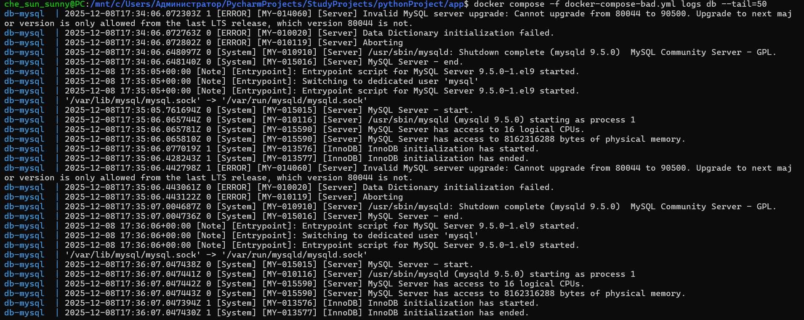

## Хороший docker compose:
```
volumes:  # создаем постоянное внутреннее хранилище для записей бд
  db_data:

services:
  db:
    image: mysql:8.0  # конкретная версия
    container_name: db-mysql
    environment:
      MYSQL_ROOT_PASSWORD: ${DB_ROOT_PASSWORD}
      MYSQL_DATABASE: ${DB_NAME}
      MYSQL_USER: ${DB_USER}
      MYSQL_PASSWORD: ${DB_PASSWORD}
    volumes:
      - db_data:/var/lib/mysql  # данные сохраняются в volume
      - ./init.sql:/docker-entrypoint-initdb.d/init.sql:ro  # readonly
    # доступа к базе данных извне нет, только внутри сети, в крайнем случае можно открыть доступ с localhost
    healthcheck:  # проверка готовности бд
      test: [ "CMD", "mysqladmin", "ping", "-h", "localhost" ]
      timeout: 20s
      retries: 10
      interval: 30s
      start_period: 40s
    restart: unless-stopped  # не перезапускается после череды ошибок или ручной остановки


  app:
    build: .
    container_name: predict-app
    environment:
      DB_HOST: db
      DB_NAME: ${DB_NAME}
      DB_USER: ${DB_USER}
      DB_PASSWORD: ${DB_PASSWORD}  # пароли в файле .env
    # доступа к приложению извне нет, только через nginx
    depends_on:
      db:
        condition: service_healthy  # доступ только по готовности
    restart: unless-stopped  # не перезапускается после череды ошибок или ручной остановки


  nginx:
    image: nginx:1.25-alpine  # конкретная версия
    ports:
      - "80:80"
    volumes:
      - ./nginx.conf:/etc/nginx/nginx.conf:ro  # readonly
    depends_on:
      - app
    restart: unless-stopped  # не перезапускается после череды ошибок или ручной остановки
```

### Исправлено в docker-compose-good.yml:
1. Объявлены конкретные версии образов - воспроизводимость окружения и контроль за обновлениями
2. Пароли вынесены в .env
3. Закрыт порт БД - доступ только из контейнера
4. Закрыт порт приложения - доступ только через nginx
5. Добавлен healthcheck для БД (для которой это критично), есть проверка в depends_on - `condition: service_healthy`
6. Добавлен том для данных - `db_data:/var/lib/mysql`
7. `restart: unless-stopped` - останавливает контейнер после череды ошибок или ручной остановки
8. Файлы конфигурации монтируются с флагом :ro (read-only), что предотвращает их модификацию из контейнера, обеспечивая безопасность и целостность

### Запуск:
Контейнеры запускаются
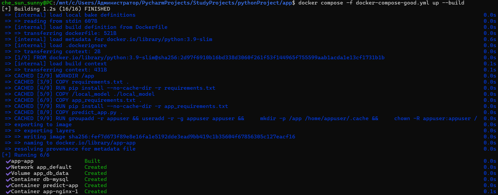
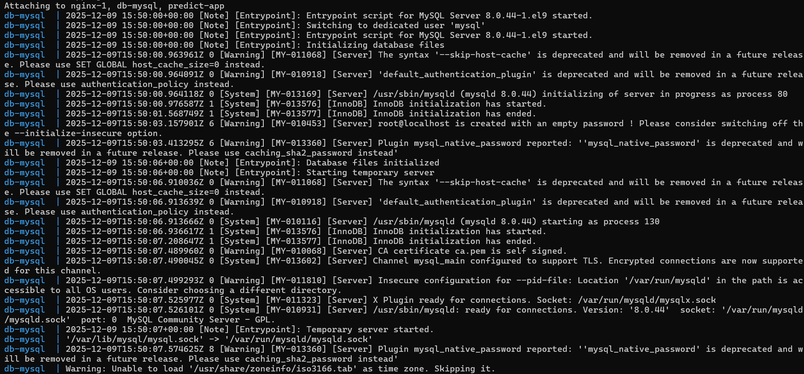
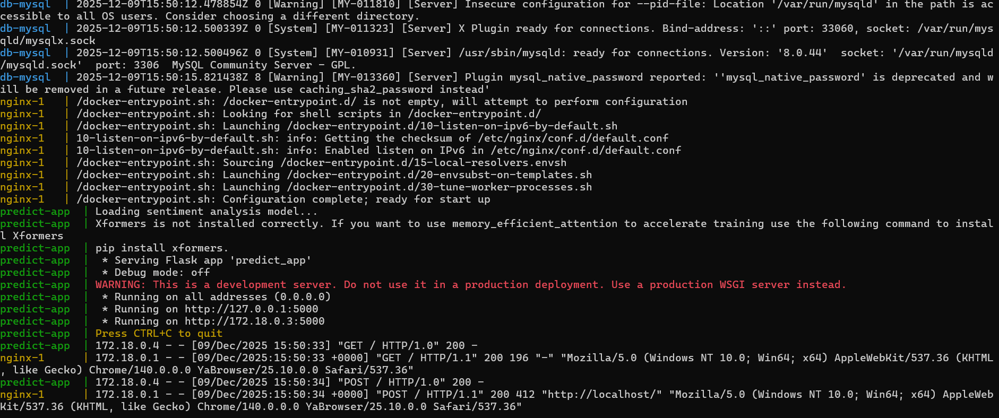
---


*Приложение грозу не любит*

----
Проверим, что контейнеры видят друг друга по сети
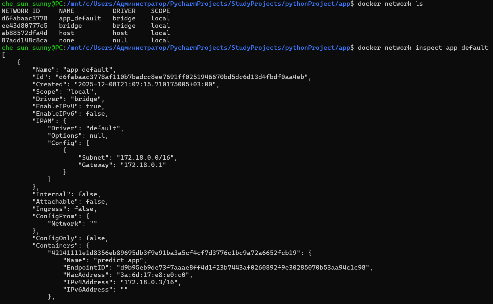
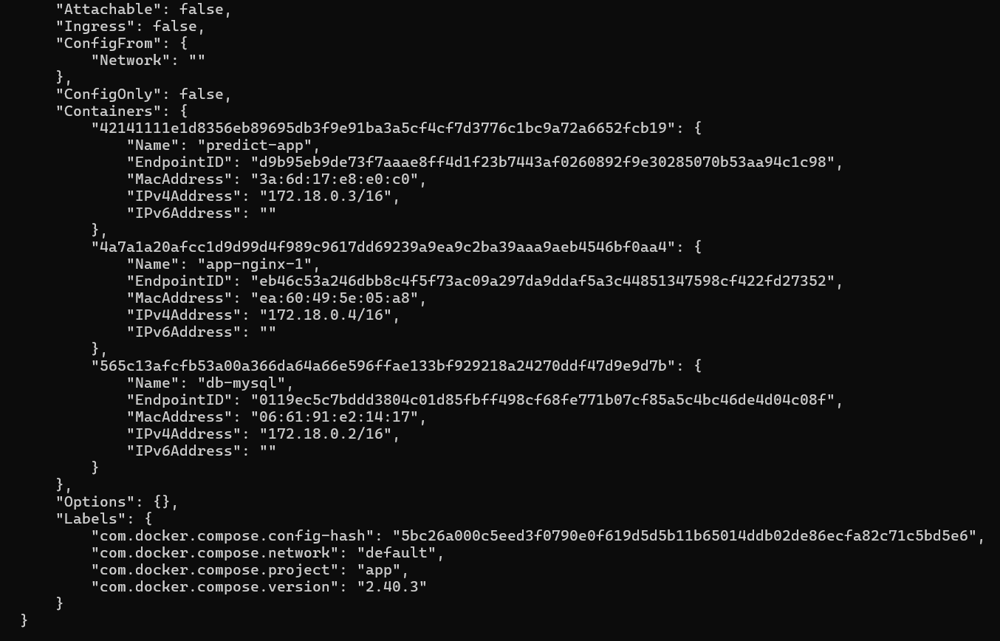

Но доступ снаружи есть только к nginx
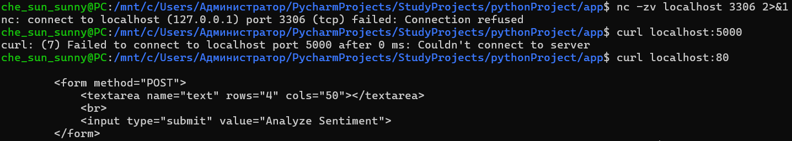

## Изоляция контейнеров
Теперь сделаем так, чтобы контейнеры совсем не видели друг друга по сети: создадим для каждого контейнера изолированную сеть

```
volumes:
  db_data:

services:
  db:
    command: --default-authentication-plugin=mysql_native_password
    image: mysql:8.0
    container_name: db-mysql
    environment:
      MYSQL_ROOT_PASSWORD: ${DB_ROOT_PASSWORD}
      MYSQL_DATABASE: ${DB_NAME}
      MYSQL_USER: ${DB_USER}
      MYSQL_PASSWORD: ${DB_PASSWORD}
    volumes:
      - db_data:/var/lib/mysql
      - ./init.sql:/docker-entrypoint-initdb.d/init.sql
    healthcheck:
      test: [ "CMD", "mysqladmin", "ping", "-h", "localhost" ]
      timeout: 20s
      retries: 10
      interval: 30s
      start_period: 40s
    restart: unless-stopped
    networks:
      - db_network


  app:
    build: .
    container_name: predict-app
    environment:
      DB_HOST: db
      DB_NAME: ${DB_NAME}
      DB_USER: ${DB_USER}
      DB_PASSWORD: ${DB_PASSWORD}
    depends_on:
      db:
        condition: service_healthy
    restart: unless-stopped
    networks:
      - app_network


  nginx:
    image: nginx:1.25-alpine
    ports:
      - "80:80"
    volumes:
      - ./nginx.conf:/etc/nginx/nginx.conf:ro
    depends_on:
      - app
    restart: unless-stopped
    networks:
      - web_network


networks:
  db_network:
    driver: bridge
  app_network:
    driver: bridge
  web_network:
    driver: bridge
```

Но тогда наш сервис не запустится, так как контейнеры не смогут общаться между собой. Начнется череда перезапусков из-за ошибок.
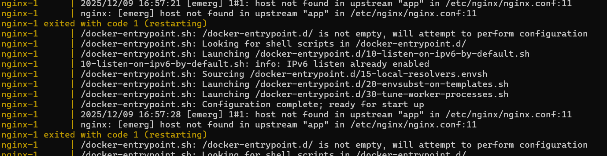

Так что создадим две изолированные сети и будем использовать app как шлюз:

```
volumes:
  db_data:

services:
  db:
    command: --default-authentication-plugin=mysql_native_password
    image: mysql:8.0
    container_name: db-mysql
    environment:
      MYSQL_ROOT_PASSWORD: ${DB_ROOT_PASSWORD}
      MYSQL_DATABASE: ${DB_NAME}
      MYSQL_USER: ${DB_USER}
      MYSQL_PASSWORD: ${DB_PASSWORD}
    volumes:
      - db_data:/var/lib/mysql
      - ./init.sql:/docker-entrypoint-initdb.d/init.sql
    healthcheck:
      test: [ "CMD", "mysqladmin", "ping", "-h", "localhost" ]
      timeout: 20s
      retries: 10
      interval: 30s
      start_period: 40s
    restart: unless-stopped
    networks:
      - db_app_network


  app:
    build: .
    container_name: predict-app
    environment:
      DB_HOST: db
      DB_NAME: ${DB_NAME}
      DB_USER: ${DB_USER}
      DB_PASSWORD: ${DB_PASSWORD}
    depends_on:
      db:
        condition: service_healthy
    restart: unless-stopped
    networks:
      - db_app_network
      - app_web_network


  nginx:
    image: nginx:1.25-alpine
    ports:
      - "80:80"
    volumes:
      - ./nginx.conf:/etc/nginx/nginx.conf:ro
    depends_on:
      - app
    restart: unless-stopped
    networks:
      - app_web_network


networks:
  db_app_network:
    driver: bridge
  app_web_network:
    driver: bridge
```
Теперь всё работает


_Онет, передали секрет! (хахаха)_

### Список сетей:
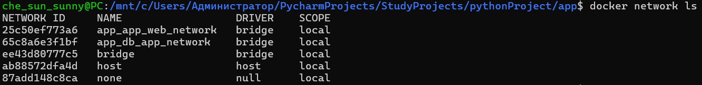

### Информация о сетях:

**Сеть для nginx**


**Сеть для БД**

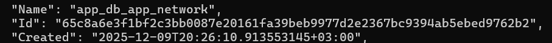
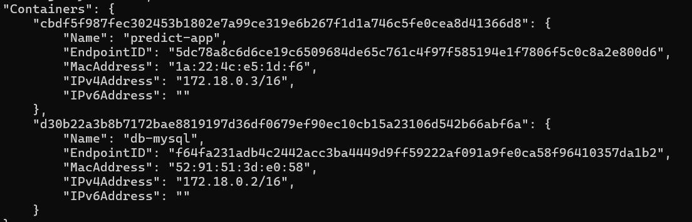

**Nginx не видит базу данных**

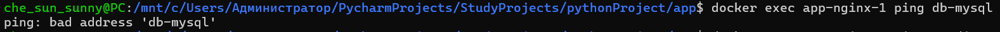

### Как работает такая изоляция?
Для каждого кластера создаётся своя изолированная виртуальная сеть Docker. Внутри одной сети контейнеры могут обращаться друг к другу по IP или по имени контейнера (так как в Docker есть встроенный DNS), но напрямую контейнеры, находящиеся в разных сетях, общаться не могут. Взаимодействие происходит через контейнер-маршрутизатор, подклученный сразу к нескольким сетям.

### Вывод
Docker compose предоставляет прикольные возможности для конфигурации контейнеров и настройки сетевого соединения между сервисами. Поначалу было сложно разобраться, и постоянно возникали ошибки с базой данных, но в итоге всё получилось! Нам понравилось!

